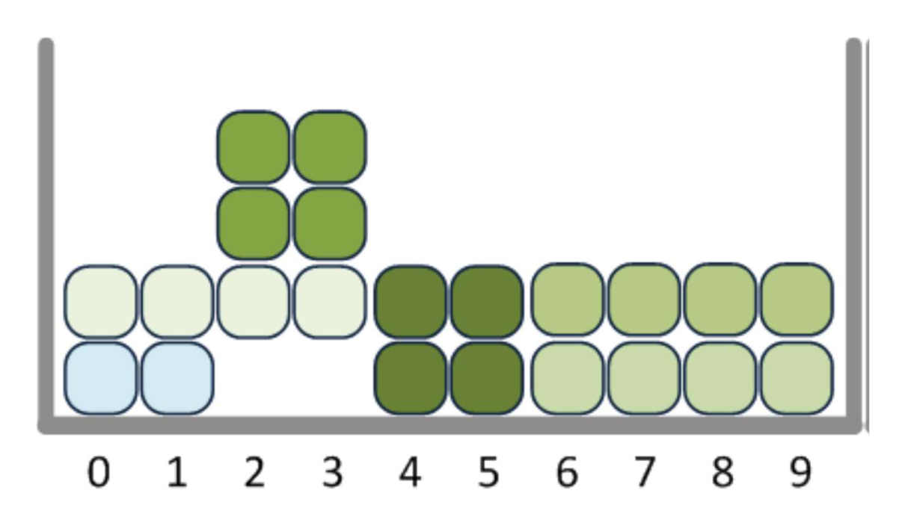
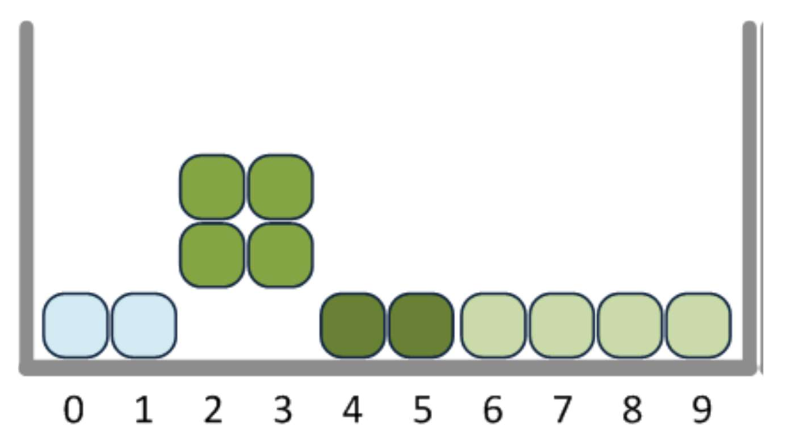

# Simplified Tetris Engine

## Description

This is a simplified Tetris engine that simulates piece placement and row clearing according to classic Tetris rules, with some simplifications:

- Pieces have fixed orientations (no rotation)
- Pieces fall based on custom row drop physics (specified below)
- Full rows are cleared automatically
- The grid is 10 units wide
- Maximum height is 100 units
- Outputs the final stack height after processing the input sequence

## Usage

You can run the engine in two ways:

### (1) Using input redirection

```bash
python tetris.py < input.txt > output.txt
```

### (2) Providing input file as argument

```bash
python tetris.py input.txt > output.txt
```

## Input Format

The engine reads input from STDIN or a file, where each line contains a comma-separated sequence of piece placements. Each piece is denoted by:

- A letter (Q, Z, S, T, I, L, or J) representing the piece shape
- A digit (0-9) representing the leftmost column where the piece will be placed

Example input:

```text
Q0,I2,I6,I0,I6,I6,Q2,Q4
```

## Row Drop Physics

The row drop physics in this engine are simplified s.t. after underlying rows clear, falling rows location is determined by the maximum height of a sitting square. An example of this is shown below:



becomes



even though the 2 and 3 columns are floating.
